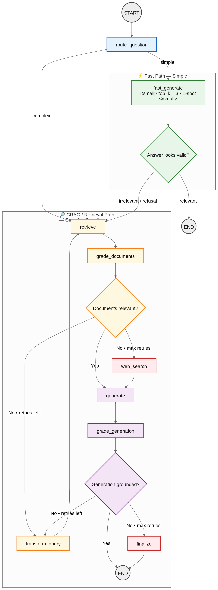

# NextBridge Assistant

An internal RAG-powered chatbot for NextBridge employees. Answers company/policy questions from internal documents, falls back to a scoped web search, and handles HR-style workflows (leave, WFH, meal subscription, MIS complaints) end-to-end via email — including reading and surfacing department replies. Includes both a conversational agent and a self-correcting CRAG/Self-RAG graph for document Q&A, exposed as separate endpoints for comparison.

## Features

- **Document Q&A (RAG)** — ingests internal PDFs (policies, HR forms, ISO docs) via PyMuPDF, chunks them with `RecursiveCharacterTextSplitter` (800 chars, 200 overlap), embeds via Ollama, and retrieves from a FAISS vector store.
- **Hybrid retrieval** — BM25 keyword search + FAISS semantic search combined via Reciprocal Rank Fusion (`EnsembleRetriever`), wrapped in a `MultiQueryRetriever` that generates multiple LLM-rephrased query variants before searching, then re-ranked with a cross-encoder (`cross-encoder/ms-marco-MiniLM-L-6-v2`) for the final top-k.
- **Web search fallback** — Tavily search scoped to NextBridge's official domain, used only when internal docs don't have the answer.
- **Agentic tool use (`/query`)** — a LangGraph ReAct agent (not hardcoded if/else) decides which tool(s) to call: docs search, web search, or an action tool. Streams responses token-by-token.
- **Self-correcting CRAG/Self-RAG graph (`/query/graph`)** — an explicit `StateGraph` with typed state and conditional edges that grades retrieved documents before generating, rewrites the query and re-retrieves (or falls back to web search) if retrieval was insufficient, then grades the generated answer against its context and can loop again if it's not grounded. Includes adaptive routing: questions classified as SIMPLE take a lightweight bypass path, with an escape hatch back into the full correction loop if that bypass produces a refusal.
- **HR workflows via email** — employees can request leave, work-from-home, meal subscriptions, or file MIS complaints through natural conversation. The agent collects required fields, shows a confirmation summary, and only sends the email after explicit "yes."
- **Reply checking** — employees can ask for updates; the agent checks the inbox (IMAP) for department replies matching their employee ID, shows the reply, drafts an acknowledgment, and sends it after confirmation.
- **Conversation memory** — multi-turn flows (e.g., filling out a leave request over several messages) are remembered per chat session via a LangGraph checkpointer.
- **Text-to-speech** — a speaker button on each response reads it aloud instantly using the browser's native Web Speech API.
- **Speech-to-text** — a mic button lets employees speak their question instead of typing it.
- **Streamlit frontend** — multi-chat sidebar (like ChatGPT), new chat button, per-chat history.

## Tech Stack

| Layer | Tool |
|---|---|
| Document loading | PyMuPDF (`fitz`) |
| Chunking | `RecursiveCharacterTextSplitter` (chunk_size=800, overlap=200) |
| Embeddings | Ollama `qwen3-embedding:latest` (via remote Ollama server) |
| Vector store | FAISS |
| Keyword search | BM25 (`rank_bm25`) |
| Retrieval fusion | `EnsembleRetriever` (RRF) + `MultiQueryRetriever` |
| Reranking | Cross-encoder (`cross-encoder/ms-marco-MiniLM-L-6-v2`) |
| LLM | Ollama (`gpt-oss:latest`, swappable — served remotely via Cloudflare tunnel) |
| Agent framework | LangGraph (`create_react_agent` for `/query`; custom `StateGraph` for `/query/graph`) |
| Web search | Tavily (domain-scoped) |
| Backend API | FastAPI |
| Email | Gmail SMTP (send) + IMAP (read replies) |
| Frontend | Streamlit |
| TTS | Browser-native Web Speech API |

## Project Structure

```
project_root/
├── main.py                          # CLI entrypoint (optional, for quick testing)
├── test_crag_graph.py               # Standalone script to trace the CRAG graph node-by-node
├── frontend/
│   └── app.py                       # Streamlit chat UI
├── app/
│   ├── main_api.py                  # FastAPI entrypoint
│   ├── src/
│   │   └── config.py                # All environment-driven settings
│   ├── api/
│   │   ├── routes.py                # /query (streaming agent), /query/graph (CRAG), /health
│   │   ├── schemas.py               # Request/response models
│   │   └── state.py                 # Shared app state (retriever, etc.)
│   ├── ingestion/
│   │   ├── pdf_loader.py            # Load + chunk PDFs (PyMuPDF + RecursiveCharacterTextSplitter)
│   │   └── run_ingestion.py         # Build or load the hybrid retriever
│   ├── embeddings/
│   │   └── embedder.py              # Ollama embeddings
│   ├── vectorstore/
│   │   ├── faiss_store.py           # Save/load FAISS index + raw chunks (batched embedding)
│   │   ├── hybrid_retriever.py      # BM25 + FAISS + RRF + MultiQuery
│   │   └── reranker.py              # Cross-encoder reranking
│   ├── llm/
│   │   └── ollama_llm.py            # Ollama chat model
│   ├── agent/
│   │   └── nextbridge_agent.py      # System prompt, tool registry, ReAct agent builder
│   ├── graph/
│   │   ├── state.py                 # GraphState (TypedDict)
│   │   ├── nodes.py                 # route_question, retrieve, grade_documents,
│   │   │                            #   transform_query, web_search_node, generate,
│   │   │                            #   grade_generation, finalize, fast_generate
│   │   ├── edges.py                 # Conditional routing functions
│   │   ├── build_graph.py           # Assembles the StateGraph
│   │   └── run_graph.py             # Wraps graph.invoke() for the API
│   └── tools/
│       ├── rag_tool.py              # nextbridge_docs_search (used by the ReAct agent)
│       ├── web_search.py            # nextbridge_web_search (Tavily)
│       ├── email_utils.py           # Shared SMTP send helper
│       ├── email_tool.py            # send_leave_email
│       ├── wfh_tool.py              # send_wfh_email
│       ├── meal_tool.py             # send_meal_subscription_email
│       ├── mis_tool.py              # send_mis_complaint_email
│       ├── email_reader.py          # IMAP search + parsing
│       ├── reply_tool.py            # check_pending_replies, get_reply_details
│       └── ack_tool.py              # send_acknowledgment_email
```
## Workflow - C-RAG

## Setup

### 1. Install dependencies

```bash
pip install -qU langchain-community langchain-ollama faiss-cpu rank_bm25 pymupdf \
  langchain-text-splitters langchain langchain-classic sentence-transformers \
  fastapi "uvicorn[standard]" python-dotenv langgraph langchain-tavily \
  streamlit requests edge-tts
```

### 2. Environment variables

Create a `.env` file in the project root:

```
TAVILY_API_KEY=your_tavily_key

SMTP_EMAIL=your_email@gmail.com
SMTP_APP_PASSWORD=your_16_char_app_password

GM_EMAIL=gm@nextbridge.com
FOOD_DEPT_EMAIL=food@nextbridge.com
MIS_EMAIL=mis@nextbridge.com
```

`OLLAMA_BASE_URL` and `OLLAMA_MODEL` / `EMBED_MODEL_ID` are set directly in `app/src/config.py` rather than `.env`, since the tunnel URL changes whenever the remote Ollama tunnel restarts — check it's current before running.

**Gmail App Password:** Google Account → Security → 2-Step Verification (must be on) → App Passwords → generate one for "Mail". Use that here, not your real Gmail password. IMAP must also be enabled: Gmail Settings → Forwarding and POP/IMAP → Enable IMAP.

### 3. Add source documents

Drop your PDFs (policies, handbooks, forms) into the folder set by `DATA_PATH` in `app/src/config.py`.

### 4. Run the backend

```bash
uvicorn app.main_api:app --reload
```

First run will parse, chunk, embed (in batches, to avoid overloading the remote Ollama server), and index your PDFs, then save the FAISS index + raw chunks locally so future runs load instantly. Delete `app/data/faiss_index` to force a rebuild (needed any time the embedding model or chunking method changes).

### 5. Run the frontend

```bash
streamlit run frontend/app.py
```

Opens at `http://localhost:8501`.

## API Endpoints

| Endpoint | Behavior |
|---|---|
| `POST /query` | ReAct agent, streams the answer token-by-token. Best for general conversation and HR workflows (leave/WFH/meal/MIS/replies). |
| `POST /query/graph` | CRAG/Self-RAG graph, returns one final JSON response (not streamed) after the graph completes: `{"answer", "retrieval_mode", "retry_count", "route"}`. Best for document Q&A where retrieval self-correction matters. |
| `GET /health` | Reports whether the retriever has finished loading. |

Both `/query` and `/query/graph` take `{"question": str, "session_id": str}`.

## Notes & Known Limitations

- **In-memory conversation checkpointer** — chat memory resets if the backend restarts. Swap `MemorySaver` for `SqliteSaver` (`langgraph-checkpoint-sqlite`) for persistence across restarts.
- **No database for requests/replies** — reply matching works by parsing the employee ID and request type directly out of email subject lines, not a stored record. This means a reply will keep showing as "available" every time it's checked, since nothing is marked as acknowledged.
- **PyMuPDF has no OCR** — source PDFs must have real selectable text; scanned/image-only PDFs will yield empty chunks.
- **Remote Ollama dependency** — both the LLM and embeddings run on a separate machine reached via a Cloudflare quick tunnel, which is ephemeral and can change URL or drop under load (embedding large batches has previously triggered `502` errors from the tunnel origin). `OLLAMA_BASE_URL` needs periodic updating.
- **LLM-as-judge grading is not fully reliable** — `grade_documents` and `grade_generation` (in the CRAG graph) have been observed to reject correct, well-grounded answers, especially with the smaller local model. The `best_generation` safeguard in `finalize` mitigates this by restoring the last confirmed-grounded answer rather than trusting the final grade blindly, but the grader prompts would benefit from few-shot examples or a stronger dedicated grading model.
- **Adaptive routing's fast path can still miss** — `fast_generate` (for questions classified SIMPLE) uses a narrower `top_k=3` single-shot retrieval with no correction loop. It self-checks its own output for refusal language and falls through into the full CRAG path if it looks like a failure, but misclassification (e.g., a question that sounds like a single fact but actually needs multiple document sections) can still cost one wasted fast-path attempt before recovering.
- **Gmail SMTP/IMAP** is meant as a placeholder for testing. Swap for a dedicated provider (Resend, Brevo) before any real deployment.

## Possible Next Steps

- Persistent conversation memory (SQLite/Postgres checkpointer)
- Lightweight request/reply tracking (flat file or small DB) to avoid re-showing acknowledged replies
- Structured (JSON) output for the grading nodes instead of loose string matching, for more reliable parsing
- A dedicated, stronger model for grading/reflection nodes, separate from the generation model
- Swap Gmail for a dedicated transactional email provider